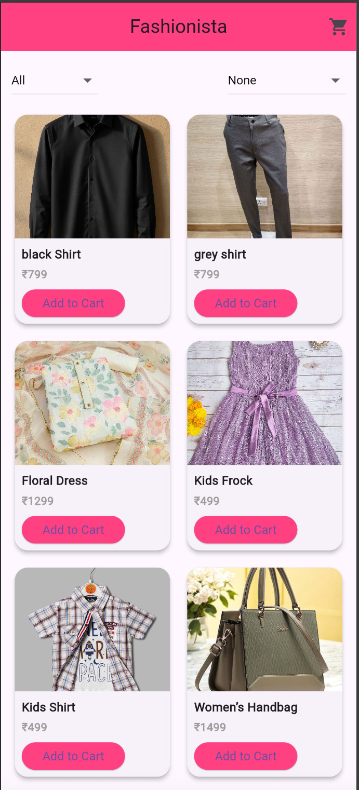
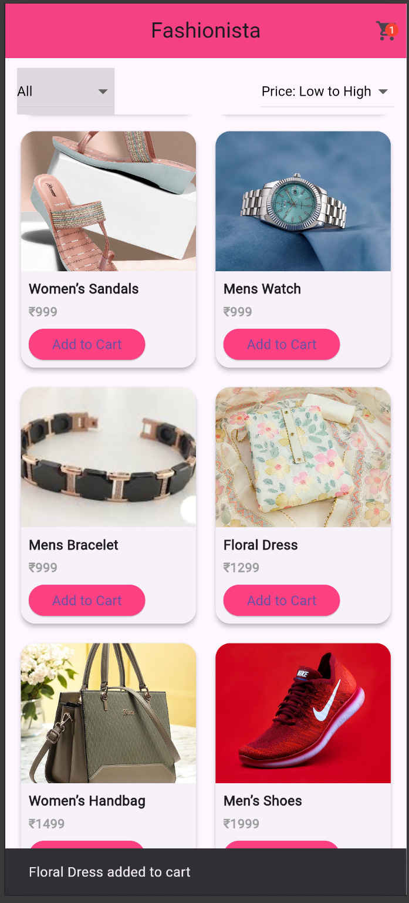
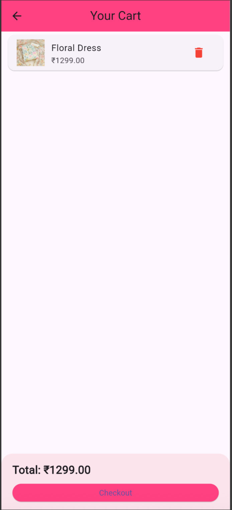
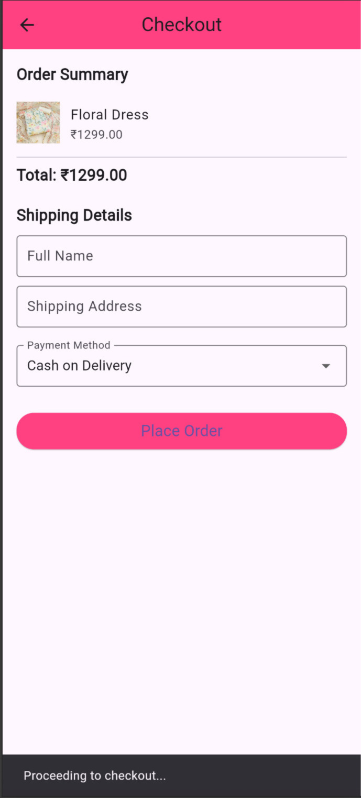
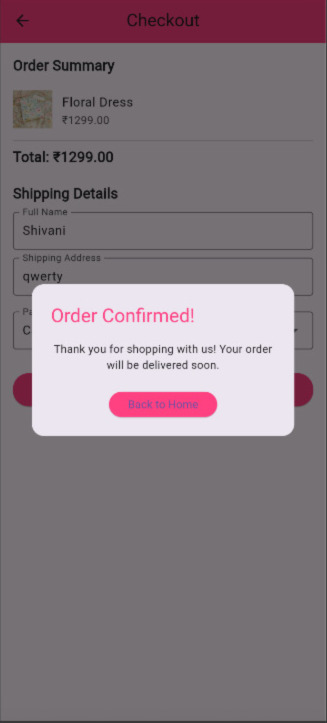

# Fashionista - Flutter E-Commerce App

<div align="center">
  
  
  
</div>

<br/>

A modern, elegant **Flutter-based cross-platform mobile application** for fashion e-commerce. Browse curated fashion collections with a beautiful, responsive UI featuring products like clothing, accessories, footwear, and handbags.

---

## About The Project

**Fashionista** is a Flutter mobile application that showcases a modern approach to fashion retail. The app provides users with an intuitive interface to browse fashion items displayed in a responsive grid layout with high-quality product images, pricing details, and interactive elements.

Built with **Material Design** principles and a cohesive **pink color theme**, Fashionista delivers an elegant shopping experience across Android and iOS platforms.

### Key Features

- **Modern UI Design** - Clean, elegant interface with Material Design components
- **Responsive Layout** - 2-column grid view that adapts to different screen sizes
- **Product Catalog** - Display of 8 curated fashion items with images and pricing
- **Favorite Items** - Heart icon for marking favorite products (UI ready)
- **Add to Cart** - Shopping cart buttons on each product card (UI ready)
- **Bottom Navigation** - Quick access to Home, Cart, and Checkout sections
- **Cross-Platform** - Works on Android, iOS, Web, and Desktop platforms

---

## Project Objectives

- Build a user-friendly mobile application for fashion e-commerce  
- Provide comprehensive product browsing experience  
- Implement responsive and adaptive UI layouts  
- Demonstrate Flutter's cross-platform capabilities  
- Create a scalable foundation for future e-commerce features  
- Apply Material Design principles and best practices  

---

## Technologies Used

| Technology | Purpose |
|------------|---------|
| **Flutter SDK** | Cross-platform mobile app development framework |
| **Dart** | Programming language |
| **Material Design** | UI component library |
| **GridView** | Responsive product grid layout |
| **Image.network** | Remote image loading |
| **ThemeData** | Centralized app styling and theming |

---

## Project Structure

```
lib/
├── main.dart           # App entry point and configuration
├── home_page.dart      # Product catalog page with grid view
├── cart_page.dart      # Shopping cart page (if exists)
├── checkout_page.dart  # Checkout page (if exists)
└── cart_provider.dart  # State management (if exists)

android/                # Android platform files
ios/                    # iOS platform files
web/                    # Web platform files
windows/                # Windows desktop files
macos/                  # macOS desktop files
linux/                  # Linux desktop files
```

---

## Getting Started

### Prerequisites

Before running this project, ensure you have:

- Flutter SDK (3.0 or higher)
- Dart SDK (3.0 or higher)
- Android Studio / Xcode (for mobile development)
- VS Code or Android Studio with Flutter plugins

### Installation

1. **Clone the repository**
   ```bash
   git clone https://github.com/ShivuXCode/FahionistaFlutter.git
   cd FahionistaFlutter
   ```

2. **Install dependencies**
   ```bash
   flutter pub get
   ```

3. **Run the app**
   ```bash
   flutter run
   ```

4. **Build for specific platform**
   ```bash
   # Android
   flutter build apk
   
   # iOS
   flutter build ios
   
   # Web
   flutter build web
   ```

---

## Screenshots

<div align="center">
  
  
  
  
  
</div>

<div align="center">
  <p><i>Fashionista app showcasing Home, Cart, Checkout, and Product views</i></p>
</div>

---

## System Architecture

### Current Implementation

```
Flutter App (main.dart)
      ↓
FashionApp Widget
      ↓
MaterialApp → Theme Configuration
      ↓
HomePage Widget
      ↓
Static Product Data (List<Map>)
      ↓
GridView Builder → Product Cards → UI Rendering
```

### Data Flow
1. **App Launch** → Initialize MaterialApp with pink theme
2. **HomePage Load** → Retrieve static product list
3. **UI Render** → Display products in 2-column grid
4. **User Interaction** → Button taps (favorites/cart - currently non-functional)

---

## Current Modules

### 1. App Initialization Module
- App launch and configuration
- Theme setup with pink color scheme
- Navigation routing

### 2. Product Display Module
- 8 hardcoded fashion products
- Grid layout with images, names, and prices
- Network image loading from Imgur

### 3. UI Layout Module
- AppBar with app title
- Responsive grid view (2 columns)
- Product cards with shadows and rounded corners

### 4. Navigation Module (UI Only)
- Bottom navigation bar
- Home, Cart, Checkout navigation items
- Currently non-functional (no routing)

### 5. Theme & Styling Module
- Pink primary color theme
- Poppins font family
- Consistent Material Design styling

---

## License

This project is open source and available under the [MIT License](LICENSE).

---

## Author

**ShivuXCode**

- GitHub: [@ShivuXCode](https://github.com/ShivuXCode)
- Project Link: [https://github.com/ShivuXCode/FahionistaFlutter](https://github.com/ShivuXCode/FahionistaFlutter)

---

## Acknowledgments

- Flutter documentation and community
- Material Design guidelines
- Imgur for product image hosting

---

<div align="center">
  <p>Made with Flutter</p>
</div>
